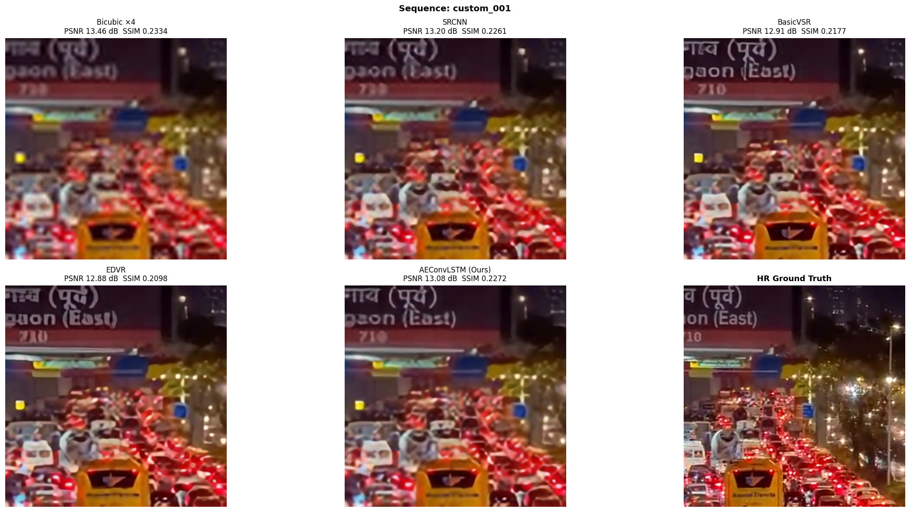
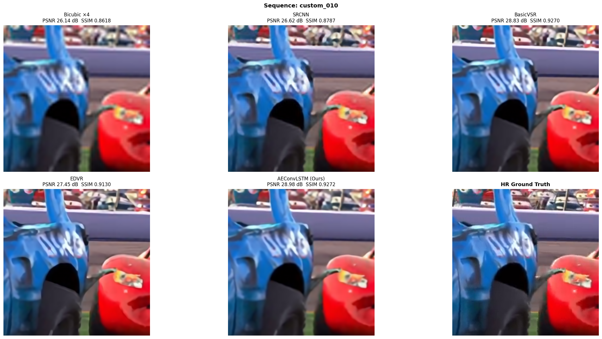
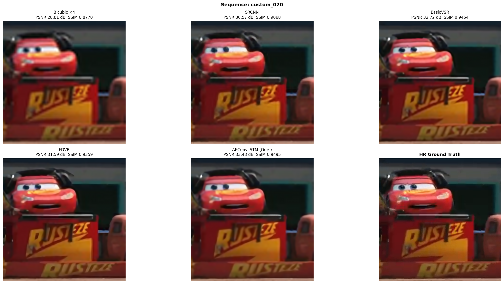
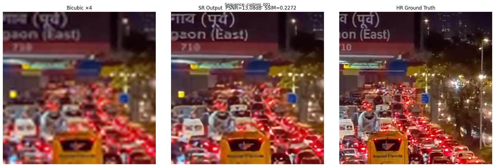

# AEConvLSTM — Attention-Enhanced ConvLSTM Video Super-Resolution


---

## Overview

This project implements a complete **×4 Video Super-Resolution (VSR)** pipeline in PyTorch.  
Given **7 consecutive low-resolution (LR) frames**, the network produces a super-resolved version of the **center frame (im4)** at 4× spatial resolution.

The model — **AEConvLSTM** (Attention-Enhanced Convolutional LSTM) — combines:

- Deformable convolution alignment 
- Squeeze-excitation temporal attention
- ConvLSTM sequence modelling
- Residual PixelShuffle upsampling

Trained and evaluated on the **Vimeo-90K septuplet** dataset.

---

## Results

Evaluated on a 23-sequence custom test set (Vimeo-90K format, ×4 scale).  
Baseline checkpoints are **automatically downloaded** from OpenMMLab on first use.

| Method | PSNR (dB) ↑ | SSIM ↑ | Time (ms/seq) ↓ |
|---|---|---|---|
| Bicubic ×4 | 26.40 | 0.7930 | 0.03 |
| SRCNN [1] | 27.31 | 0.8157 | 1.44 |
| EDVR [3] | 28.75 | 0.8516 | 9.65 |
| BasicVSR [2] | 29.46 | 0.8576 | 34.29 |
| **AEConvLSTM (Ours)** | **29.82** | **0.8592** | **4.46** |

Our model achieves the highest PSNR and SSIM while being **7.7× faster than BasicVSR** on NVIDIA RTX 4060 GPU.

---

## Visual Comparisons

Each image shows (top row) Bicubic · SRCNN · BasicVSR and (bottom row) EDVR · **AEConvLSTM (Ours)** · HR Ground Truth.





Single-model comparison (Bicubic / Ours / HR):



---

## Architecture

```
7 LR Frames (im1–im7)
      │
┌─────▼──────────────┐
│  CNN Feature        │  Shared weights → (B, 7, 64, H, W)
│  Extractor          │
└─────┬──────────────┘
      │
┌─────▼──────────────┐
│  Deformable         │  DCNv2 alignment per frame → center
│  Alignment          │  torchvision.ops.deform_conv2d
└─────┬──────────────┘
      │
┌─────▼──────────────┐
│  Temporal           │  SE channel attention
│  Attention          │  + softmax frame weights
└─────┬──────────────┘
      │
┌─────▼──────────────┐
│  ConvLSTM           │  7-step sequence → final hidden h₇
└─────┬──────────────┘
      │
┌─────▼──────────────┐
│  Reconstruction     │  4× ResBlocks + PixelShuffle ×4
│  Head               │
└─────┬──────────────┘
      │
Bicubic(im4) + Residual = SR Output
```

---

## Installation

```bash
git clone <repo-url>
cd video_sr
pip install -r requirements.txt
```

Requires **PyTorch ≥ 2.2** and **torchvision ≥ 0.17** (for `torchvision.ops.deform_conv2d`).

---

## Dataset Setup

Download **Vimeo-90K septuplet** from http://toflow.csail.mit.edu/ and extract the archive.

```bash
python scripts/prepare_dataset.py \
  --src_dir ./archive \
  --out_dir ./data/vimeo_prepared \
  --scale   4 \
  --workers 16
```

This generates per-frame HR/LR PNG pairs and `train_manifest.csv` / `test_manifest.csv`.

**Output structure:**
```
data/vimeo_prepared/
  train/00001_0001/hr/im{1-7}.png
                  /lr/im{1-7}.png
  test/  ...
  train_manifest.csv
  test_manifest.csv
```

### Custom Dataset with Video Crop Tool

Use the interactive GUI to build a custom test set from any video:

```bash
python video_crop_tool.py
# or drag-in a video file:
python video_crop_tool.py my_video.mp4
```

Features:
- Mouse-drag spatial crop (default 448×256 HR, auto-generates 112×64 LR at ×4)
- Frame slider for temporal navigation + 7-frame strip preview
- YouTube download via URL (auto-tries Chrome → Firefox → other browsers for cookies)
- Exports Vimeo-90K-compatible sequences to `test_manifest.csv`

---

## Smoke Test

Verify the full pipeline on synthetic data (no dataset needed):

```bash
python smoke_test.py          # uses CUDA if available
python smoke_test.py --cpu    # force CPU
```

---

## Training

```bash
python train.py --config configs/default.yaml
```

Resume from checkpoint:
```bash
python train.py --config configs/default.yaml --resume checkpoints/latest.pth
```

Monitor with TensorBoard:
```bash
tensorboard --logdir logs/tensorboard/
```

**Key hyperparameters** (`configs/default.yaml`):

| Parameter | Value | Note |
|---|---|---|
| batch_size | 32 | For 48 GB VRAM; reduce if needed |
| patch_size | 256 | HR crop; LR = 64×64 |
| lr | 2e-4 | AdamW |
| warmup_epochs | 5 | Linear ramp |
| num_epochs | 100 | Cosine decay to 1e-6 |
| grad_clip | 1.0 | Prevents LSTM gradient explosion |

---

## Evaluation

Standard evaluation against bicubic baseline + ablation study:
```bash
python evaluate.py --checkpoint checkpoints/best_model.pth
```

**Comparison mode** — automatically downloads pretrained SRCNN, BasicVSR, EDVR checkpoints from OpenMMLab on first run:
```bash
python evaluate.py --checkpoint checkpoints/best_model.pth --compare
```

Outputs:
- `results/per_sequence_metrics.csv` — per-sequence PSNR/SSIM
- `results/visual_<id>.png` — Bicubic / Ours / HR panels for every test sequence
- `results/compare/compare_<id>.png` — 6-panel comparison for every test sequence
- `results/compare/compare_avg.csv` — averaged metrics table

Override pretrained baseline paths (optional — auto-download is used by default):
```bash
python evaluate.py --checkpoint checkpoints/best_model.pth --compare \
  --srcnn_ckpt    checkpoints/baselines/srcnn.pth \
  --basicvsr_ckpt checkpoints/baselines/basicvsr.pth \
  --edvr_ckpt     checkpoints/baselines/edvr.pth
```

---

## Project Structure

```
video_sr/
├── assets/                       # Sample result images (committed)
├── configs/
│   └── default.yaml              # All hyperparameters
├── data/
│   ├── __init__.py
│   └── vimeo_dataset.py          # Dataset + DataLoader factory
├── models/
│   ├── __init__.py
│   ├── vsr_net.py                # Full pipeline + ablation flags
│   ├── deformable_aligner.py     # DCNv2 via torchvision.ops.deform_conv2d
│   ├── feature_extractor.py      # Shared CNN extractor
│   ├── temporal_attention.py     # SE channel + softmax temporal attention
│   ├── convlstm.py               # ConvLSTMCell from scratch
│   ├── reconstruction.py         # ResBlocks + PixelShuffle ×4
│   └── baseline_models.py        # SRCNN / BasicVSR / EDVR (mmagic-compatible)
├── losses/
│   └── losses.py                 # L1 + Sobel edge loss
├── metrics/
│   └── metrics.py                # PSNR + SSIM (no skimage dependency)
├── scripts/
│   └── prepare_dataset.py        # Vimeo-90K → HR/LR PNG pairs + manifests
├── train.py                      # Training loop (AMP bfloat16, TensorBoard)
├── evaluate.py                   # Metrics, ablation, visual saves, --compare mode
├── video_crop_tool.py            # Interactive PyQt5 GUI for custom datasets
├── smoke_test.py                 # Zero-dataset pipeline correctness check
└── requirements.txt
```

---

## Pretrained Baselines

When `--compare` is used, the following checkpoints are automatically downloaded to `checkpoints/baselines/`:

| Model | Source | Dataset |
|---|---|---|
| SRCNN | OpenMMLab / mmediting | DIV2K ×4 |
| BasicVSR | OpenMMLab / mmediting | Vimeo-90K BI ×4 |
| EDVR-M | OpenMMLab / mmediting | REDS ×4 |

Implementations in `models/baseline_models.py` are faithful re-implementations that load these checkpoints without requiring `mmcv` or `mmagic` installed.

---

## References

[1] C. Dong, C. C. Loy, K. He, X. Tang. "Learning a Deep Convolutional Network for Image Super-Resolution." *ECCV 2014*.

[2] K. C. Chan, X. Wang, K. Yu, C. Dong, C. C. Loy. "BasicVSR: The Search for Essential Components in Video Super-Resolution and Beyond." *CVPR 2021*.

[3] X. Wang, K. C. Chan, K. Yu, C. Dong, C. C. Loy. "EDVR: Video Restoration with Enhanced Deformable Convolutional Networks." *CVPRW 2019*.

[4] T. Xue, B. Chen, J. Wu, D. Wei, W. T. Freeman. "Video Enhancement with Task-Oriented Flow." *IJCV 2019*. *(Vimeo-90K dataset)*

[5] X. Shi, Z. Chen, H. Wang, D.-Y. Yeung, W.-K. Wong, W.-C. Woo. "Convolutional LSTM Network: A Machine Learning Approach for Precipitation Nowcasting." *NeurIPS 2015*.

[6] X. Zhu, H. Hu, S. Lin, J. Dai. "Deformable ConvNets v2: More Deformable, Better Results." *CVPR 2019*.

---

## License

MIT
